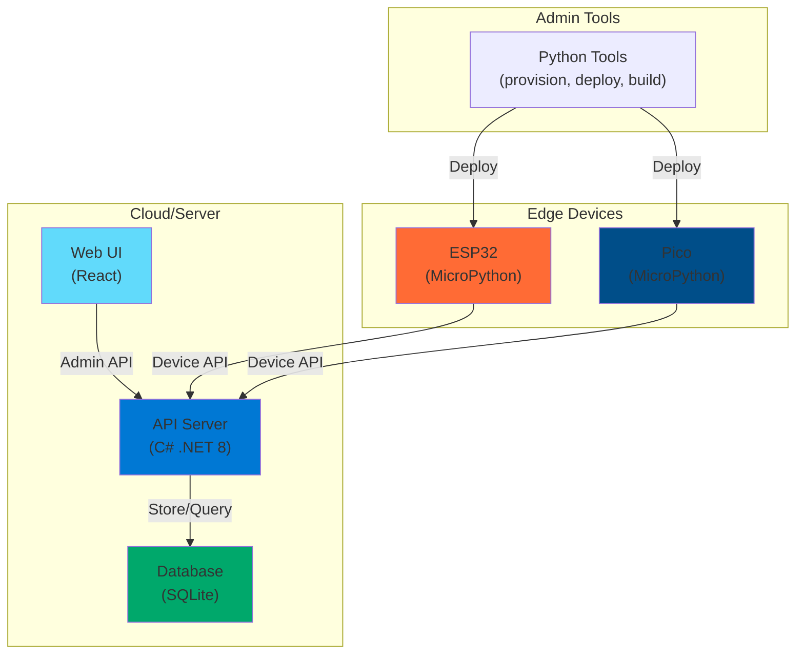

# HomeIOT 🏠

A comprehensive IoT platform for managing embedded devices (ESP32/Pico), executing server-side Python modules, and monitoring device health through a centralized dashboard.

## Key Features

- **Device Management**: Register, monitor, and control multiple IoT devices across platforms (ESP32, Raspberry Pi Pico)
- **Module System**: Deploy and manage versioned Python modules on devices with remote execution and result tracking
- **Interactive Dev Commands**: Execute arbitrary Python code on devices for debugging and testing
- **Dashboard Analytics**: Real-time metrics on device health, module activity, and system status
- **OTA Updates**: Over-the-air firmware updates with rollback support
- **User Management**: Multi-user admin dashboard with role-based authentication
- **Comprehensive Logging**: Device logs, module results, and execution tracking for troubleshooting

## Quick Start

### Running the Server (30 seconds)

**Option 1: Direct .NET Execution** (for development)
```bash
# Clone and navigate to project
git clone <repo-url>
cd HomeIOT

# Run the API server
dotnet run --project api/src/api.csproj
```

Server starts at: `http://localhost:5228`

**Option 2: Docker Compose** (for easy setup)
```bash
docker-compose up -d
```

Server accessible at: `http://localhost:5228` (or your configured hostname)

### Initial Login

1. Open `http://localhost:5228` in your browser
2. Login with credentials:
   - **Username**: `Admin`
   - **Password**: `123`
3. ⚠️ **IMPORTANT**: Change the admin password immediately in the Web UI (Users section)
4. Verify setup: Dashboard should display "0 devices online"

---

## Project Structure

```
HomeIOT/
├── api/                    # .NET 8 Backend API
│   ├── src/               # API source code (controllers, services, data)
│   └── tests/             # xUnit tests
├── edge/                  # MicroPython edge runtime
│   ├── platforms/         # Platform-specific code (ESP32, Pico)
│   ├── shared/            # Common app logic and HAL
│   └── tools/             # Provisioning, deployment, and utility scripts
├── web-ui/                # React + TypeScript Web Dashboard
├── data/                  # SQLite database (auto-created)
└── docs/                  # Detailed guides and references
```

## System Architecture



### Layers Overview

| Layer | Technology | Role |
|-------|-----------|------|
| **Web UI** | React + TypeScript + Vite | Admin dashboard for managing devices, modules, users, and monitoring |
| **API** | C# .NET 8 + Entity Framework Core | REST API for device communication and admin operations |
| **Edge Runtime** | MicroPython | Firmware running on ESP32/Pico; polls for modules, executes commands |
| **Database** | SQLite | Stores devices, modules, logs, heartbeats, users, and execution results |

---

## Getting Started Guides

### For Setup & Deployment

| Guide | Purpose |
|-------|---------|
| [📖 Server Setup](docs/setup-server.md) | Install and configure the API server (direct .NET & Docker) |
| [📖 Edge Device Setup](docs/setup-edge-device.md) | Provision and deploy firmware to ESP32/Pico devices |

### For Feature Usage

| Guide | Purpose |
|-------|---------|
| [📖 Dashboard](docs/features-dashboard.md) | Understand real-time metrics and system status |
| [📖 Device Management](docs/features-devices.md) | Monitor, filter, and control devices |
| [📖 Module System](docs/features-modules.md) | Create, upload, assign, and execute modules |
| [📖 User Management](docs/features-users.md) | Manage admin users and authentication |
| [📖 Dev Commands](docs/features-dev-commands.md) | Execute remote code for debugging |

---

## Prerequisites

- **C# / .NET 8 SDK** — Required to run the API server
- **Python 3.8+** — Required for edge tools (provisioning, deployment, building)
- **Node.js 18+** — Required for Web UI development
- **Docker** (optional) — For containerized deployment via Docker Compose
- **mpremote** — Required for device deployment (`pip install mpremote`)

## Installation

### Dependencies Setup

```bash
# Clone the repository
git clone <repo-url>
cd HomeIOT

# Setup Python environment for edge tools
python -m venv .venv
.venv\Scripts\activate              # Windows
# or: source .venv/bin/activate     # macOS/Linux

pip install -r edge/requirements.txt

# Setup Node dependencies for Web UI (optional for dev)
cd web-ui
npm install
cd ..
```

### First Run

1. Start the API server (see Quick Start above)
2. Web UI opens automatically or navigate to `http://localhost:5228`
3. Login with `Admin` / `123`
4. **IMPORTANT**: Change admin password immediately

---

## Testing

All code changes require corresponding tests. Run the full test suite:

```bash
# API tests (.NET)
dotnet test api/tests/homeiot.api.tests.csproj

# Edge tests (Python)
python -m pytest edge

# Web UI tests (optional)
cd web-ui && npm test
```

---

## Development Workflow

### Typical Development Day

1. **Start API server** (background)
   ```bash
   dotnet run --project api/src/api.csproj
   ```

2. **Start Web UI dev server** (in new terminal)
   ```bash
   cd web-ui && npm run dev
   ```

3. **Access Web UI** at `http://localhost:5173` (Vite dev server)

4. **Make changes** to code and tests

5. **Run tests** to verify changes
   ```bash
   # Terminal 1: dotnet test api/tests/homeiot.api.tests.csproj
   # Terminal 2: python -m pytest edge
   # Terminal 3: npm test (in web-ui)
   ```

### Code Conventions

- **C# / API**: One class per file, `PascalCase` file names, records for DTOs, `snake_case` JSON properties
- **Python / Edge**: MicroPython-compatible, pytest tests in `edge/shared/tests/`
- **TypeScript / Web**: React components in `src/components/`, pages in `src/pages/`

See [.github/copilot-instructions.md](.github/copilot-instructions.md) for detailed conventions.

---

## Typical Workflows

### Setting Up a New Device

1. **Generate device config** (one-time per device)
   ```bash
   python edge/tools/provision_config.py \
     --platform esp32 \
     --device-id my-device-001 \
     --api-url http://192.168.1.100:5228 \
     --api-key <generated-key> \
     --wifi-ssid YOUR_WIFI \
     --wifi-password YOUR_PASSWORD
   ```

2. **Deploy firmware to device** (via USB)
   ```bash
   python edge/tools/deploy_device.py \
     --platform esp32 \
     --port auto \
     --config-file edge/tools/generated/esp32-config.json
   ```

3. **Verify in Dashboard** — Device should appear online within 60 seconds

👉 Full guide: [Edge Device Setup](docs/setup-edge-device.md)

### Creating and Assigning a Module

1. Navigate to **Admin → Modules → Create Module**
2. Upload Python file with `exec()`-compatible code
3. Navigate to module detail → **Assign**
4. Select target devices and version
5. Device fetches and executes within 60 seconds
6. View results in device detail → **Module Results**

👉 Full guide: [Module System](docs/features-modules.md)

### Debugging a Device with Dev Commands

1. Navigate to **Admin → Dev Commands**
2. Write Python code (e.g., `print(device_info)`)
3. Select target device
4. Queue command
5. View result in real-time (device executes within 2 seconds)

👉 Full guide: [Dev Commands](docs/features-dev-commands.md)

---

## Configuration & Customization

### Server Configuration

Edit `api/src/appsettings.json`:

```json
{
  "RuntimeControl": {
    "NextHeartbeatMs": 60000,                    // Device heartbeat interval
    "DevPollIntervalMs": 2000,                   // Dev command polling
    "ModuleAssignmentPollIntervalMs": 60000      // Module assignment polling
  },
  "Admin": {
    "MasterUsername": "Admin",
    "MasterPassword": "YOUR_SECURE_PASSWORD"    // Change in production!
  }
}
```

For production, also change:
- `Jwt.SecretKey` — Use a cryptographically secure random key
- `ConnectionStrings.DefaultConnection` — Use production database
- Remove CORS localhost origins in `appsettings.json`

### Device Configuration

Device config is auto-generated by `provision_config.py` and includes:
- WiFi credentials (encrypted, device-ID-bound)
- API URL and authentication
- Polling intervals and power settings
- Logging configuration

---

## Troubleshooting

### Device not appearing in dashboard
- Check API URL is correct and reachable from device
- Verify WiFi connection on device (use dev commands to test)
- Check device logs via `GET /api/devices/{id}/logs` in dashboard

### Module not executing
- Verify module syntax is correct (test locally first with dev commands)
- Check device is online (heartbeat recent)
- View module result for error details

### Web UI not loading
- Confirm API server is running on port 5228
- Check CORS configuration in `appsettings.json` includes your origin
- Clear browser cache and reload

For more, see the detailed guides linked above.

---

## License

GNU AFFERO GENERAL PUBLIC LICENSE Version 3

## Support

For issues, questions, or feature requests, please open an issue in the repository.
